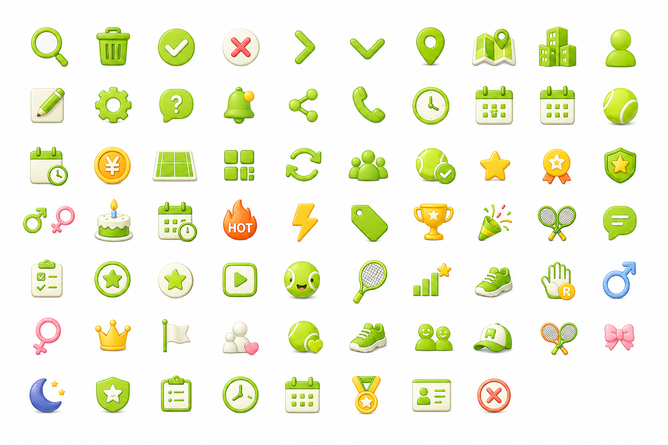
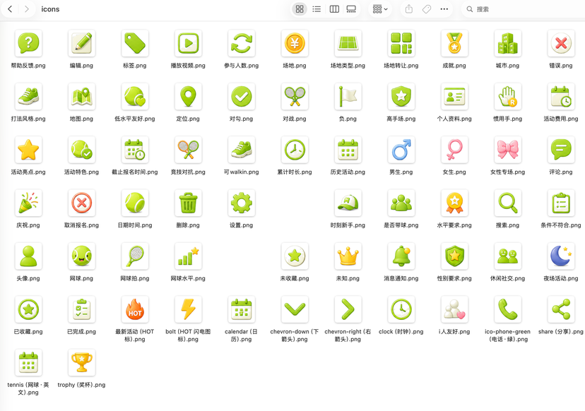

# Prompt to Asset Pack

> 批量生成整套风格一致、透明背景、自动命名、经过QA校验的icon素材包。


[English](README.en.md) · [安装](#安装) · [支持的资产](#不只是-icon) · [平台兼容](#agent-平台兼容)

**Prompt to Asset Pack** 是从 `Prompt to Icon Pack` 升级而来的批量视觉资产生产流水线。它可以根据自然语言或角色参考图生成 Icon、Emoji、表情包、头像、徽章和游戏物品：先建立风格锚点并规划多张 Sheet，再进行非网格拆分、背景透明化、外部语义命名、单批与跨批 QA，最后输出 PNG、WebP、可选 SVG、工程映射和 ZIP。

## 背景
在做小程序ui优化时，直接用开源免费 icon 库比较丑，希望围绕ip形象和对应风格产出一套完整的icon素材库。分批生成成本高、风格一致性难把控而且还得逐个抠图命名导出。于是做了一个 skill，可以针对一整张icon图表，自动拆分、抠图、命名；后续又升级，直接将中间过程自动化，从 prompt 直接生成素材包，而且增加 qa 校验，针对切图问题会自动优化重新识别裁切

## 实际效果

| 一次生成 | 自动拆分、透明化、命名和质检 |
| --- | --- |



## 它解决什么问题

1. 单张生成容易出现配色、透视、材质和角色身份漂移。
2. 每个资产分别调用模型会增加成本、等待时间和审核工作。
3. 一张 Sheet 生成后仍需手动切图、抠图、命名、缩放和打包。
4. 四五十个资产不适合挤在一张大图里，需要跨 Sheet 的一致性机制。
5. “切出来了”不等于“可发布”，还可能有语义错误、重复、漏项、白色误删或角色变脸。

## 核心亮点

### 四五十个资产也能保持一致

大批量请求会共享一份不可变的 Style Contract 和参考锚点，再拆成多张完整布局：

- `quality`：每张最多 9 个，适合 3D 角色和表情包；45 个会拆成 5 张 3×3。
- `balanced`：每张最多 15 个，适合大多数 Icon 系统。
- `economy`：每张最多 25 个，只适合简单扁平资产。

系统会检查跨批次的角色身份、色板、主体比例、留白、线条或材质，以及是否有重复和漏项。失败时只重做问题批次。

### 未指定内容时自动使用预设

内置通用 UI 24/48、Emoji 反应、IP 表情、商店和运动主题。App 请求默认使用通用 UI；上传角色参考图则默认进入表情包模式，不会把所有模糊需求都武断地变成 Emoji。

### 先查图库，再决定是否生成

对于没有 IP / 参考图约束的通用 UI Icon，流水线会先从 Iconify 中配置的 Lucide、Material Symbols 等集合查找。高置信度匹配可以直接下载并清理为安全 SVG；有歧义的候选必须人工确认。没有匹配的部分再进入 Sheet 生成，或使用默认只做成本预演的 Recraft 原生 SVG 适配器。这样常见的“主页、搜索、设置”无需重复花钱生成，自定义资产仍保留完整生成能力。

### 不依赖严格网格

拆分器检测真实前景对象并聚类成阅读顺序，不会把 AI 生成图简单平均切成固定小格。

### 不误删内部白色

只移除与局部裁剪边界连通的亮色中性背景。眼白、衣服、帽子、网线、播放按钮和高光等内部白色仍保持不透明。

遇到白帽子、白衣服等语义不明确区域时，可选 rembg 的 BiRefNet / SAM 候选会与边界法及保守融合结果一起比较。疑似白色误删现在会直接阻止发布，而不是只写一条警告；模型输出仍必须通过源图对照 QA。

### 名称来自需求，而不是重新猜图

有序资产清单是唯一命名真值。生成图中禁止出现标签和文件名，也不会让 OCR 猜一个生成前已经知道的名称。

### QA 会诊断失败原因

- 生成、数量、语义、角色身份、重复或风格错误：重生成对应批次。
- 检测、裁切、分离细节或透明度错误：重新拆分或局部修正。
- 命名错误：修正外部映射。
- SVG 过于复杂或回渲染不一致：保留 PNG/WebP。

最终 ZIP 必须同时通过确定性 QA、视觉语义 QA 和全局跨批次 QA。


## 不只是 Icon

```yaml
asset_kind: icon | emoji | sticker | avatar | badge | item-sprite
```

仓库包含六个可组合 Skill：

- `generate-asset-pack`：通用资产规划、预设、风格锚点、多 Sheet、QA 和打包。
- `generate-sticker-pack`：Character Bible、反应清单、身份一致性和后置字幕。
- `split-icon-sheet`：非网格拆分、旧图 OCR、内部白色保护和裁切 QA。
- `vectorize-asset-pack`：原生/描摹 SVG、安全清理和回渲染 QA。
- `export-asset-pack`：多尺寸 PNG/WebP、雪碧图、CSS、TypeScript 和 ZIP。
- `generate-icon-batch`：兼容旧版 Icon 调用方式。

## 使用示例

```text
使用 $generate-asset-pack，为网球小程序生成 48 个产品 Icon。
采用统一的青柠绿色与黄色 3D 风格，balanced 密度，中文命名，
输出透明 PNG 和 WebP，跨批次 QA 全部通过后再打包。
```

```text
使用 $generate-sticker-pack 和我上传的小猫参考图。
生成默认 24 个反应表情，保持脸型、耳朵、围巾和配色一致，
拆分后添加可靠的中文文字，最后输出透明 ZIP。
```

## 安装

```bash
git clone https://github.com/Signal-M/prompt-to-icon-pack.git
cd prompt-to-icon-pack

python3 scripts/install-platform.py codex
python3 scripts/install-platform.py claude-code
python3 scripts/install-platform.py qwen-code
python3 scripts/install-platform.py workbuddy
```

`./scripts/install.sh` 仍然是 Codex 的快捷安装命令。默认不会覆盖已有 Skill，只有显式添加 `--force` 才会替换。

生成千问办公可审查上传包：

```bash
python3 scripts/install-platform.py qwenwork
```

这一步只生成 ZIP，不会自动发布。详情见 [平台适配说明](docs/platforms.md)。

## Agent 平台兼容

- Codex：提供 `.codex-plugin/plugin.json` 和标准 Agent Skills。
- Claude Code：提供 `.claude-plugin/plugin.json` 和共享 `skills/`。
- Qwen Code：提供 `qwen-extension.json`。
- WorkBuddy：支持当前验证过的 `~/.workbuddy/skills` 目录，不同版本可能需要调整。
- 千问办公：可以生成上传包；是否能上传或公开发布取决于账号和企业权限。

生成新图仍要求目标 Agent 具备图片生成工具。没有图片生成能力时，规划、已有 Sheet 拆分、QA、矢量化和导出仍可使用。

## 输出

```text
final-assets/
├── assets/
├── asset-map.json
├── assets.ts
├── contact-sheet.png
├── qa-summary.json
└── asset-pack.zip

exported/
├── png/{64,128,256}/
├── webp/{64,128,256}/
├── svg/                    # 仅适合矢量化的资产
├── sprite/
├── assets.css
├── assets.ts
├── export-manifest.json
└── asset-export.zip
```

## 依赖与测试

```bash
python3 -m pip install -r requirements.txt
python3 -m pip install -r requirements-vector.txt  # 可选 SVG QA
python3 -m pip install -r requirements-segmentation.txt  # 可选 BiRefNet / SAM 抠图候选
./scripts/validate.sh
```

测试覆盖图库路由、Recraft 付费前预演、语义 Alpha 融合、可复现回归集、预设与跨 Sheet 规划、导出、SVG 安全清理、旧版兼容和多平台清单。`BENCHMARKS.md` 来自 1000 个带真值 Alpha 的程序化样本，不是手写营销数字。

## 已知限制

- 图片生成仍具有随机性，偶尔需要定向重试。
- 风格锚点能提高一致性，但无法数学保证角色几何完全相同。
- 毛发、烟雾、玻璃、半透明材质和共享场景仍是抠图难点。

如果它帮你省掉了一轮生成、切图、命名或 QA，欢迎点一个 Star，让更多开发者发现这个项目。

当前实测数据：[1000 个 Icon 的 Alpha 基准与 25 个 Icon 成本模型](BENCHMARKS.md)。
## License

[MIT](LICENSE)
