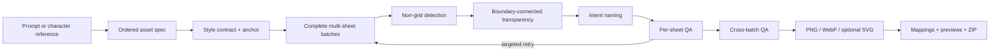

# Prompt to Asset Pack

> One prompt or character reference in. A coherent, named, transparent, QA-ready visual asset pack out.


[简体中文](README.zh-CN.md) · [Installation](#installation) · [Asset types](#one-engine-many-asset-types) · [Platforms](#agent-platforms)

**Prompt to Asset Pack** turns a brief or character reference into a production-oriented collection of icons, emoji, stickers, avatars, badges, or item sprites. It plans style-anchored sheets, detects assets without trusting a rigid grid, removes only the exterior background, assigns names from an external semantic specification, runs closed-loop per-sheet and cross-batch QA, and exports transparent PNG/WebP assets, optional SVG, mappings, previews, and ZIP packages.

The repository keeps the original name `prompt-to-icon-pack` and the `$generate-icon-batch` compatibility entry point. The product and main skill now cover the larger prompt-to-assets workflow.

## Demo

| Generated together | Split, transparent, named, and checked |
| --- | --- |
|  |  |

The first extraction of this real example found insufficient padding around a detached megaphone detail. The publish gate withheld the ZIP, a localized crop retry fixed the defect, and only the passing result was packaged.

## Why this exists

AI image generation is good at visual exploration, but a generated sheet is not yet an asset library:

1. Generating one image at a time drifts in palette, perspective, rendering, and character identity.
2. Repeated calls multiply cost, latency, prompting, and review work.
3. Generating a sheet still leaves manual cropping, background removal, naming, resizing, and packaging.
4. Large 40–50 asset requests need cross-sheet consistency, not one overcrowded canvas.
5. A successful crop can still contain the wrong concept, damaged alpha, a duplicate, or a different-looking mascot.

Prompt to Asset Pack joins those missing steps into one auditable pipeline.

## What makes it different

### Style-anchored large packs

Large requests are split into complete sheets under one immutable style contract. `quality`, `balanced`, and `economy` density profiles support detailed character packs, ordinary icon systems, and high-density simple assets. A 45-item character pack becomes five 3×3 sheets; ordinary icons can use larger balanced batches.

### Presets when the brief is incomplete

Bundled presets include universal UI sets, emoji reactions, character reactions, commerce, and sports. App requests default to UI concepts; character references default to reaction stickers. The system never blindly turns every unspecified request into emoji.

### No rigid-grid assumption

AI rarely obeys pixel-perfect spacing. The splitter detects foreground objects and clusters them into reading order instead of dividing the canvas into equal rectangles.

### White-safe transparency

Only bright neutral pixels connected to the local crop boundary become transparent. Enclosed white clothes, eyes, labels, highlights, play symbols, or racket strings remain opaque.

### Intent-based naming

The ordered asset specification is the source of truth. Labels are forbidden inside generated sheets, and OCR is not asked to rediscover a name known before generation.

### Failure-aware closed-loop QA

Failures are routed instead of blindly retried:

- generation, semantics, identity, duplicate, omission, or style drift → regenerate that batch;
- detection, crop, detached detail, or alpha damage → re-split or apply a local override;
- naming mismatch → correct the external mapping;
- vector complexity or render mismatch → retain PNG/WebP.

The final package requires deterministic extraction QA, semantic visual QA, and whole-pack cross-batch QA.

### Honest SVG support

Simple flat or outline artwork can use native semantic SVG. Limited-palette raster assets can use optional VTracer conversion. Every SVG is sanitized, complexity-limited, rendered back to PNG, and visually compared with its source. Detailed 3D, fur, glass, soft shadow, or gradient-heavy art stays raster when vectorization would be worse.

### Reliable sticker captions

Character art is generated without lettering. Captions such as “收到”, “谢谢”, or “冲鸭” are rendered after extraction with a real font, so wording remains accurate and localizable.

## One engine, many asset types

```yaml
asset_kind: icon | emoji | sticker | avatar | badge | item-sprite
```

The main skills are:

- `generate-asset-pack` — prompt/reference interpretation, presets, style anchors, multi-sheet planning, QA routing, and packaging.
- `generate-sticker-pack` — character bible, reaction taxonomy, identity QA, and post-rendered captions.
- `split-icon-sheet` — irregular sheet detection, OCR for legacy captioned sheets, white-safe background removal, and crop QA.
- `vectorize-asset-pack` — native/traced SVG, sanitization, complexity limits, and render-back QA.
- `export-asset-pack` — PNG/WebP variants, sprite sheets, CSS, TypeScript, and ZIP export.
- `generate-icon-batch` — backward-compatible icon entry point.

## How it works



## Quick start

Ask a compatible agent:

```text
Use $generate-asset-pack to create 48 friendly product icons for a tennis mini-program.
Use a consistent lime-green and yellow 3D style, balanced density, Chinese names,
transparent PNG and WebP outputs, and publish only after cross-batch QA passes.
```

For a character pack:

```text
Use $generate-sticker-pack with my cat reference image.
Create the default 24 reaction stickers, preserve the face, ears, colors, and scarf,
add reliable Chinese captions after extraction, and export a transparent ZIP.
```

For an existing sheet:

```text
Use $split-icon-sheet to split this sheet without assuming a grid.
Preserve internal white details, use the supplied ordered labels, and return a ZIP only after QA passes.
```

## Installation

Clone once, then install the same canonical skills for the desired client:

```bash
git clone https://github.com/m2290526022-boop/prompt-to-icon-pack.git
cd prompt-to-icon-pack

python3 scripts/install-platform.py codex
python3 scripts/install-platform.py claude-code
python3 scripts/install-platform.py qwen-code
python3 scripts/install-platform.py workbuddy
```

`./scripts/install.sh` remains the Codex shortcut. Installers refuse to overwrite existing skills unless `--force` is explicitly supplied.

Build a reviewable QwenWork upload bundle without publishing it:

```bash
python3 scripts/install-platform.py qwenwork
```

See [platform packaging](docs/platforms.md) for manifests and limitations.

## Agent platforms

- **Codex:** `.codex-plugin/plugin.json` plus personal/project Agent Skills.
- **Claude Code:** `.claude-plugin/plugin.json` plus the shared `skills/` directory.
- **Qwen Code:** `qwen-extension.json` plus personal/project skills.
- **WorkBuddy:** installer for the tested `~/.workbuddy/skills` layout; versions may differ.
- **QwenWork / 千问办公:** produces an uploadable review bundle; account and organization policies control upload or marketplace availability.

The workflow requires an image-generation capability to create new art. On an agent without an image tool, planning, splitting, QA, vectorization, and export still work, but sheet generation must come from a connected image model or a user-supplied sheet.

## Output

```text
final-assets/
├── assets/
│   ├── 001-home.png
│   └── ...
├── asset-map.json
├── assets.ts
├── contact-sheet.png
├── qa-summary.json
└── asset-pack.zip

exported/
├── png/{64,128,256}/
├── webp/{64,128,256}/
├── svg/                       # eligible assets only
├── sprite/
├── assets.css
├── assets.ts
├── export-manifest.json
└── asset-export.zip
```

## Requirements

- Python 3.10+.
- Pillow and NumPy for planning, QA, splitting, and export.
- Optional macOS Vision OCR for captioned legacy sheets.
- Optional VTracer CLI and CairoSVG for traced SVG plus render-back QA.
- An image-generation tool only when creating new sheets.

```bash
python3 -m pip install -r requirements.txt
python3 -m pip install -r requirements-vector.txt  # optional SVG QA
```

## Test

```bash
./scripts/validate.sh
```

The tests cover preset planning, 45-item quality batching, 48-item multi-sheet planning, caption rendering, PNG/WebP/sprite export, SVG sanitization, legacy compatibility, and platform manifest parsing.

## Limitations

- Image generation remains probabilistic and may require targeted retries.
- Cross-sheet style anchors improve consistency but cannot mathematically guarantee identical geometry.
- Hair, smoke, glass, translucency, and shared scenes remain difficult background-removal targets.
- Traced SVG is not equivalent to clean hand-authored vector source.
- Exact third-party store dimensions and publishing rules change; verify current official platform requirements before submission.

## Contributing

Hard sheets, identity-drift examples, extraction failures, vectorization edge cases, new presets, and exporter contributions are welcome. See [CONTRIBUTING.md](CONTRIBUTING.md).

If this removes a round of generation, cropping, naming, or QA from your workflow, consider starring the project so more builders can find it.

## License

[MIT](LICENSE)
