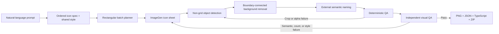

# Prompt to Icon Pack

> One prompt in. A consistent, named, transparent icon pack out.


[简体中文](README.zh-CN.md) · [Installation](#installation) · [How it works](#how-it-works) · [Limitations](#limitations)

**Prompt to Icon Pack** is a pair of Codex skills that turns a natural-language brief into a production-ready icon pack. It generates a carefully planned icon sheet, detects icons without trusting a rigid grid, removes only the exterior background, applies names from an external semantic specification, runs closed-loop QA, and exports transparent PNGs, manifests, TypeScript mappings, and a ZIP.

It is built for app, mini-program, game, and UI teams that like the visual quality of AI-generated icons but do not want to manually crop, key out, rename, and verify every asset.

## Demo

| Generated sheet | Split, transparent, and named |
| --- | --- |
|  |  |

The demo above was generated in one 3×3 sheet, split into nine transparent PNGs, named in Chinese, and checked by both deterministic and independent visual QA. The first extraction caught insufficient padding around the megaphone; a localized retry fixed it before packaging.

## The problem

Generating icons one by one sounds simple, but production use exposes three expensive gaps:

1. **Style drift** — separate generations often change perspective, proportions, palette, lighting, stroke weight, or character identity.
2. **Repeated generation cost** — one request per icon multiplies model calls, latency, prompt repetition, and review work.
3. **Manual post-processing** — a sheet still needs to be sliced, background-removed, named, normalized, checked, and packaged.

Prompt to Icon Pack connects those steps into one auditable workflow.

| Workflow | Generate one by one | Generate one sheet manually | Prompt to Icon Pack |
| --- | --- | --- | --- |
| Visual consistency | Often drifts between calls | Better shared context | Shared style contract + sheet-first batches |
| Generation calls | Usually one or more per icon | One per sheet | One per planned rectangular batch |
| Cropping and background | Repeated per icon | Manual | Automatic, non-grid detection |
| Naming | Manual | Manual or OCR-dependent | Bound to the external intent list |
| Release confidence | Manual review | Usually no formal gate | Deterministic + independent visual QA |

## Why it is different

### Sheet-first consistency

Related icons are generated together under one style contract and one canvas. Shared context makes consistent scale, rendering, palette, and character design easier than isolated prompts.

### Fewer generation calls

The planner uses complete rectangular batches such as 4×4, 3×4, or 3×3. This reduces repeated image-generation calls and can reduce cost and latency, depending on the provider and model.

### No rigid-grid assumption

AI does not reliably obey perfect spacing. The splitter detects foreground objects and clusters them into reading-order rows instead of blindly cutting equal cells.

### White-safe transparency

It removes bright neutral background pixels only when they connect to the boundary of a local crop. Enclosed white details—clothes, eyes, labels, highlights, or a play symbol—remain opaque.

### Names come from intent, not pixels

The ordered icon specification is the source of truth. Generated captions are prohibited, and OCR is not asked to rediscover names that were already known before generation.

### Closed-loop QA

The publish gate checks count, semantics, order, duplicates, omissions, style, crop coverage, alpha quality, and naming. Generation failures trigger regeneration; localized crop or alpha failures trigger re-splitting or overrides. A failed batch is never silently published as complete.

### Production-oriented output

The final package includes transparent PNGs, `icon-map.json`, `icons.ts`, a contact sheet, QA summaries, and a ZIP ready to move into an application repository.

## How it works



The repository contains two composable skills:

- `generate-icon-batch` — prompt interpretation, batch planning, image generation, semantic naming, QA routing, and final packaging.
- `split-icon-sheet` — irregular-layout detection, local background removal, caption/OCR support for existing sheets, extraction QA, and transparent PNG export.

## Installation

### One command after cloning

```bash
git clone https://github.com/m2290526022-boop/prompt-to-icon-pack.git
cd prompt-to-icon-pack
./scripts/install.sh
```

The installer copies both skills to `~/.agents/skills` and refuses to overwrite an existing installation.

### Manual installation

```bash
mkdir -p ~/.agents/skills
cp -R skills/generate-icon-batch ~/.agents/skills/
cp -R skills/split-icon-sheet ~/.agents/skills/
```

Install local processing dependencies when your Codex environment does not already provide them:

```bash
python3 -m pip install -r requirements.txt
```

## Quick start

Ask Codex:

```text
Use $generate-icon-batch to create 24 icons for a tennis mini-program.
Use one cute lime-green 3D mascot, consistent proportions and lighting.
Include home, publish event, notifications, profile, settings, location,
tennis, friends, video, calendar, venue, fee, participants, and related actions.
Export 256×256 transparent PNGs with Chinese names and a ZIP.
```

For an existing sheet:

```text
Use $split-icon-sheet to split this image into transparent PNG icons.
Preserve internal white details, name items from their captions, run visual QA,
and return a ZIP only if every icon passes.
```

Supplying an exact ordered label list produces the most predictable names and semantic QA. If the request only states a domain and count, the skill drafts a conservative icon list and exposes that interpretation during execution.

## Outputs

```text
final-icons/
├── icons/
│   ├── 001-home.png
│   ├── 002-publish-event.png
│   └── ...
├── icon-map.json
├── icons.ts
├── qa-summary.json
├── contact-sheet.png
└── icons.zip
```

- `icons/` — normalized transparent PNG files with stable numbered names.
- `icon-map.json` — ordered labels, descriptions, filenames, batch provenance, and IDs.
- `icons.ts` — application-friendly icon paths and label mappings.
- `qa-summary.json` — deterministic and semantic publish-gate results.
- `contact-sheet.png` — checkerboard preview for fast visual review.
- `icons.zip` — deployable package containing icons and runtime mappings.

## Reliability model

- Default maximum: 16 icons per generated sheet.
- Detailed characters or 3D scenes: prefer 9–12.
- Hard maximum: 25.
- Retry limit: three attempts per batch.
- Count, semantic, duplicate, omission, order, or style failure: regenerate the batch.
- Crop, merged-neighbor, lost detail, or alpha failure: re-split or apply a localized source-box override.
- Any unresolved failure: report `needs_review` and withhold the final package.

## Requirements

- Codex with the built-in image-generation tool for prompt-to-pack generation.
- Python 3.10+.
- Pillow and NumPy for local image processing.
- macOS and Swift are only required when using local Vision OCR on captioned existing sheets. The normal unlabeled generation pipeline does not require OCR.

Post-processing runs locally. The generated sheet is processed without uploading it to another background-removal service.

## Limitations

- Image generation remains probabilistic. Exact counts and semantic details sometimes require retries.
- The workflow works best when icons are visibly separated on a bright neutral exterior background.
- Hair, smoke, glass, translucent materials, and complex shared scenes are not ideal targets for this boundary-connected removal method.
- Output is raster PNG, not editable vector artwork.
- A shared sheet improves consistency but does not mathematically guarantee identical character geometry across every item.
- Provider pricing differs; fewer calls do not guarantee a specific percentage of savings.

## Roadmap

- Optional SVG tracing and vector QA.
- Cross-platform OCR for captioned legacy sheets.
- Interactive approval of the planned icon list before generation.
- Visual diff reports for retries.
- More export targets for React, Vue, Flutter, and mini-program frameworks.

## Contributing

Bug reports, hard icon sheets, extraction edge cases, and prompt improvements are welcome. See [CONTRIBUTING.md](CONTRIBUTING.md).

If this workflow saves you a round of repetitive generation and manual slicing, consider starring the repository—it helps more builders discover it.

## License

[MIT](LICENSE)
