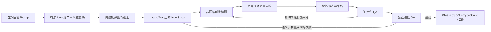

# Prompt to Icon Pack

> 一句 Prompt，生成整套风格一致、背景透明、自动命名的 Icon。


[English](README.md) · [安装](#安装) · [工作原理](#工作原理) · [已知限制](#已知限制)

**Prompt to Icon Pack** 是一组面向 Codex 的 Icon 生产 Skills。它可以把自然语言需求转换成可直接用于小程序、App、游戏或 UI 项目的 Icon 包：先规划一张或多张 Icon Sheet，再进行非网格检测、背景透明化、外部语义命名、闭环 QA，最终输出透明 PNG、映射文件、TypeScript 常量和 ZIP。

它解决的并不只是“生成图片”，而是 AI Icon 从想法到工程资产之间长期缺失的最后一公里。

## 实际效果

| ImageGen 一次生成 | 自动拆分、透明化、命名后 |
| --- | --- |
|  |  |

上面的 9 个 Icon 由一次 3×3 ImageGen 生成完成。首轮拆分发现“发布活动”的扩音器右侧留白不足，系统没有直接发布，而是通过局部 source-box 修正重新拆分；独立 QA 确认数量、语义、顺序、内部白色、透明度和命名全部通过后才生成最终 ZIP。

## 它缓解了什么问题？

### 1. 多次生成造成的风格不一致

逐个生成时，模型很容易改变透视、角色比例、颜色、光照、线条粗细或材质。同一批 Icon 放到产品里，往往看起来像来自不同设计师。

本项目采用 **sheet-first** 思路：让同一批 Icon 共享一份风格契约和同一张画布，更容易保持角色、尺寸、配色和渲染语言统一。

### 2. 每个 Icon 分别生成的调用成本

逐个生成意味着反复发送相似 Prompt、等待多个任务并逐个检查。项目会优先规划 4×4、3×4、3×3 等完整矩形批次，用更少的生成调用获得更多资产。实际费用取决于模型与服务商，因此项目不会承诺虚假的固定节省比例。

### 3. 一次生成后的手动切图、抠图和命名

传统流程通常还需要：画裁切框、去背景、修白边、检查是否截断、统一尺寸、逐个改名、整理映射、压缩打包。

这些步骤现在由流水线自动完成，并且只有通过 QA 门禁才会输出最终包。

| 工作方式 | 逐个生成 | 生成一张图后手动处理 | Prompt to Icon Pack |
| --- | --- | --- | --- |
| 视觉一致性 | 多次调用容易漂移 | 共享画布，通常更一致 | 统一风格契约 + sheet-first 批次 |
| 生成调用 | 通常每个 Icon 至少一次 | 每张 Sheet 一次 | 每个完整矩形批次一次 |
| 裁切与抠图 | 每张重复处理 | 手动 | 非网格自动检测 |
| 命名 | 手动 | 手动或依赖 OCR | 绑定外部语义清单 |
| 发布可信度 | 人工检查 | 通常没有正式门禁 | 确定性 QA + 独立视觉 QA |

## 核心亮点

### 不依赖严格网格

AI 很少严格遵守像素级间距。拆分器不会把图片平均切成固定单元格，而是检测前景对象，再按视觉位置聚类为阅读顺序。

### 不会误删 Icon 内部白色

只移除与局部裁切边界连通的亮色中性背景。帽子、衣服、眼白、网球拍网线、播放按钮等被 Icon 包围的白色区域会保留为不透明。

### 命名来自需求，不来自图片猜测

外部的有序 Icon 清单才是名称真值。生成图中禁止出现标题、编号或文件名，也不会让 OCR 去重新猜一个生成前就已经知道的名称。

### 生成 QA 与拆分 QA 分开处理

- 数量错误、语义不符、重复、漏项、顺序错误、风格漂移：重新生成该批次。
- 裁切不全、相邻 Icon 合并、局部细节丢失、透明度异常：重新拆分或增加局部 override。
- 三次仍未解决：标记 `needs_review`，不把有问题的结果包装成成功。

### 输出可以直接进入工程

除了 PNG，还会输出 `icon-map.json`、`icons.ts`、QA 摘要、透明棋盘格联系表和 ZIP。对于小程序或前端项目，不必再手写资产路径映射。

### 两层 Skill，可组合使用

- `generate-icon-batch`：从 Prompt 开始，负责需求理解、批次规划、生成、命名、语义 QA 和最终打包。
- `split-icon-sheet`：负责已有图片的非网格拆分、局部背景去除、OCR Caption 支持和提取 QA。

已经有一张 Icon Sheet 时，可以只使用底层拆分 Skill。

## 工作原理



## 安装

克隆仓库后执行：

```bash
git clone https://github.com/m2290526022-boop/prompt-to-icon-pack.git
cd prompt-to-icon-pack
./scripts/install.sh
```

安装脚本会把两个 Skill 复制到 `~/.agents/skills`，发现已有同名目录时会停止，不会静默覆盖。

也可以手动安装：

```bash
mkdir -p ~/.agents/skills
cp -R skills/generate-icon-batch ~/.agents/skills/
cp -R skills/split-icon-sheet ~/.agents/skills/
```

如果当前 Codex 环境没有自带 Pillow 和 NumPy，再执行：

```bash
python3 -m pip install -r requirements.txt
```

## 快速使用

在 Codex 中输入：

```text
使用 $generate-icon-batch，为网球活动小程序生成 24 个核心功能 Icon。
使用同一个可爱的青柠绿色 3D 吉祥物，保持角色比例、光照和配色统一。
包含首页、发布活动、消息通知、个人资料、设置、定位、网球、好友、
视频、日期、场地、费用和参与人数等功能。
输出 256×256 透明 PNG，按中文名称命名并打包 ZIP。
```

拆分已有图片：

```text
使用 $split-icon-sheet 拆分这张 Icon Sheet。
去除外部背景但保留内部白色，按照图片下方文字命名，
完成视觉 QA 后再输出 ZIP。
```

如果你提供完整、有序的名称清单，命名和语义验收会最稳定。只提供业务领域与数量时，Skill 会先生成一份保守的 Icon 规划，并在执行过程中展示它的理解。

## 输出结构

```text
final-icons/
├── icons/
│   ├── 001-首页.png
│   ├── 002-发布活动.png
│   └── ...
├── icon-map.json
├── icons.ts
├── qa-summary.json
├── contact-sheet.png
└── icons.zip
```

## 可靠性策略

- 默认每张 Sheet 最多 16 个 Icon。
- 复杂 3D 角色建议每张 9–12 个。
- 单张硬上限为 25 个。
- 每批最多闭环三次。
- 优先使用没有空位的 4×4、3×4、3×3 等布局，减少模型自动补图。
- 数量和视觉 QA 都通过后才允许执行最终打包。

## 环境要求

- 具备内置图片生成能力的 Codex。
- Python 3.10+。
- Pillow 与 NumPy。
- 只有在拆分“带文字标题的旧图”并使用本地 Vision OCR 时才要求 macOS + Swift；从 Prompt 生成的无标题 Sheet 不需要 OCR。

生成后的拆分、背景去除和打包都在本地完成，不需要把 Sheet 再上传给第三方抠图服务。

## 已知限制

- 图片生成具有随机性，精确数量和语义偶尔需要重试。
- 最适合背景明亮中性、彼此明显分离的 Icon Sheet。
- 毛发、烟雾、玻璃、液体、半透明材质和复杂共享场景不适合这种边界连通抠图方式。
- 当前输出是位图 PNG，不是可编辑 SVG。
- 同一张 Sheet 能显著改善一致性，但无法数学保证每个角色几何完全相同。
- 不同生成服务的定价方式不同，减少调用次数不等于固定比例的费用节省。

## Roadmap

- 可选 SVG 描摹与矢量 QA。
- 跨平台 Caption OCR。
- 生成前交互式确认 Icon 清单。
- 重试前后的视觉差异报告。
- React、Vue、Flutter 和小程序等更多导出模板。

## 参与贡献

欢迎提交难拆分的 Icon Sheet、背景去除边缘案例、Prompt 改进和 Bug。详见 [CONTRIBUTING.md](CONTRIBUTING.md)。

如果它帮你少做了一轮重复生成和手动切图，欢迎点一个 Star，让更多开发者看到这个工作流。

## License

[MIT](LICENSE)
